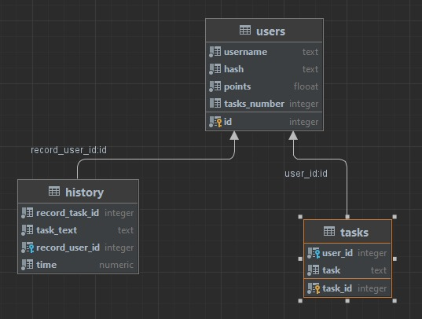
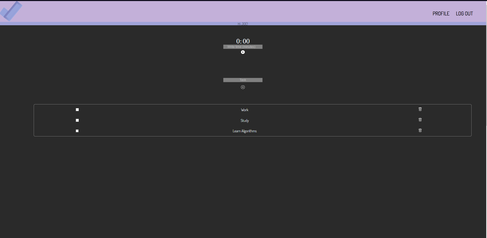
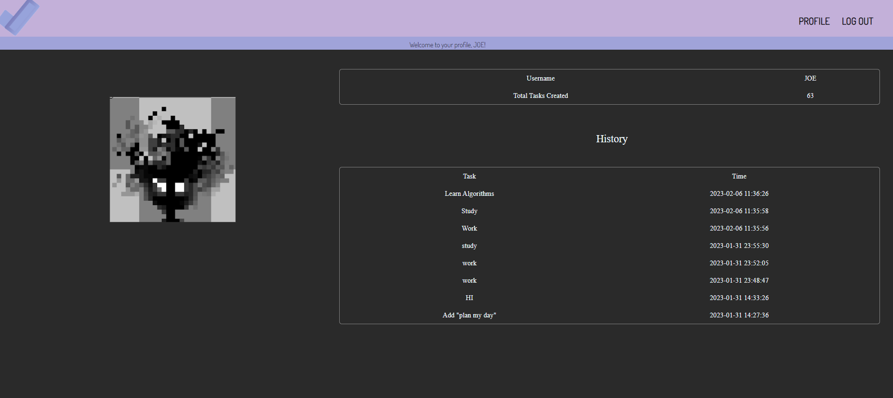

# LEVELING

#

## Privacy:

To use this application you need to register, in order to link the tasks your id, the data only exists in the local database you are using at the moment of downloading the project ("leveling.db")
and has no external connections, likewise **the passwords in the database are and will be saved as a hash.**

#

## Description:

### static/ and templates/:

The project is composed of 2 folders of resources one of them is "static" in which is the design of the application, such as .css files and images; the other is "templates" in which are all the .html files also called "routes".

All .html files use "jinja" to have as a base "layout.html", which contains some essential elements such as:

- The connection to the style sheets
- The connection to the font
- The application banner

The application banner is the one that allows the user to go to the desired route.

#

### .py files:

The application logic is found in "app.py" which is responsible for loading the .html files with the help of "render_template" a flask tool, this file also allows to connect the database and modify it through the "CS50" library by executing sqlite commands as well as edit and verify that the data is correct; this file is backed up in "helpers.py" which contains some essential functions.

#

### Leveling.db

It is a database which contains the tasks, the users and the history log, you can see the distribution of the database in this image:

  

#

### General

The application starts at the index, if the user is registered he/she will be sent to the "login" path where he/she must register, once the valid credentials have been entered he/she will be redirected to the "index" where the fields to enter the tasks to be added and the timer are located.

Once the user enters a task and confirms it, the application internally adds it to the database and links it to the user id, while creating a copy of it to keep track in the history, when this action is completed, the variables are loaded to the .html file through jinja and are presented as a table; if the user wants to delete a task, he/she only has to mark it as complete with the checkbox and click on the "trash" icon on the right side of the table to delete the task from the database.

The counter is made in JS so it has no connection with the backend of the page, it will launch a promp when the time reaches 0 notifying the user.

In the profile section you can see the user's basic data such as:

- User name
- Total tasks created

And the history limited by the last 8 tasks.

Finally, by clicking on "Log out" all credentials will be forgotten and you will be redirected to the login section.

## Screenshots

### Main Page

  

### Profile

  

